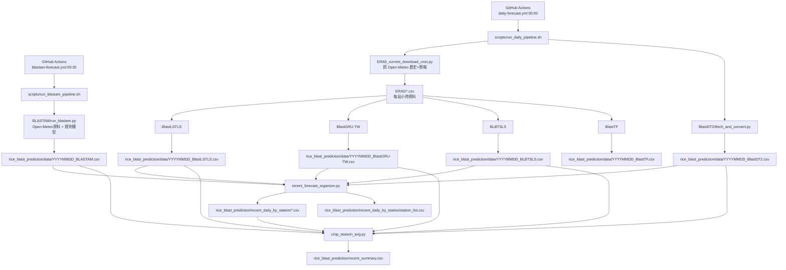

# 水稻病害預報自動化（rice_disease_forecast）

這個 repo 是用來做**台灣水稻病害風險的每日自動化更新**，把多模型的預測結果整理成：

- 逐站逐日檔（`rice_blast_prediction/recent_daily_by_station/*.csv`）
- 全站摘要檔（`rice_blast_prediction/recent_summary.csv`）
- 每日模型原始輸出（`rice_blast_prediction/data/*.csv`）

---

## 1) 每日會在什麼時間自動做什麼？

### A. 每日主流程（全模型，不含 BLASTAM）

- Workflow：`.github/workflows/daily-forecast.yml`
- 觸發：**每天台灣時間 00:00**（cron: `0 16 * * *`，UTC）
- 執行腳本：`scripts/run_daily_pipeline.sh`
- 依序執行：
  1. `models/ERA5_current_download_cron.py`
  2. `models/BlastLSTLS/cron_predict.py`
  3. `models/230127_GRU/predictor.py`
  4. `models/BLBTSLS/predict.py`
  5. `models/230128_Transformer/predictor_250628.py`（欄位名 `BlastTF`）
  6. `models/BlastDT2/fetch_and_convert.py`
  7. `models/recent_forecast_organizer.py`
  8. `models/crop_season_avg.py`

### B. 每日 BLASTAM 流程（獨立）

- Workflow：`.github/workflows/blastam-forecast.yml`
- 觸發：**每天台灣時間 00:30**（cron: `30 16 * * *`，UTC）
- 執行腳本：`scripts/run_blastam_pipeline.sh`
- 依序執行：
  1. `models/BLASTAM/run_blastam.py`
  2. `models/recent_forecast_organizer.py`
  3. `models/crop_season_avg.py`

---

## 2) Workflow 圖（每日自動化）



---

## 3) 各模型資料從哪裡來？做了哪些前處理？

> 下方是「每天自動化」路徑。一次性 backfill/舊流程已整理在 `legacy/`。

### 3.1 ERA5 小時資料製備（`models/ERA5_current_download_cron.py`）

**資料來源**
- 站點清單：`weather_station_list`（GitHub raw CSV）
- 氣象資料：Open-Meteo
  - 歷史：`archive-api.open-meteo.com`
  - 預報：`api.open-meteo.com`（含 `models=ecmwf_aifs025_single`）

**抓取欄位（小時）**
- `time`
- `temperature_2m`
- `relativehumidity_2m`
- `precipitation`
- `windspeed_10m`
- `winddirection_10m`

**前處理**
- 計算風場分量：
  - `u = windspeed_10m * cos(270 - winddirection_10m)`
  - `v = windspeed_10m * sin(270 - winddirection_10m)`
- 合併歷史與預報後，以 `time` 去重。

**暫存/輸出位置**
- 輸出到：`ERA5/`（可由 `ERA5_OUTPUT_DIR` 覆寫）
- 檔名格式：`站號_站名_緯度_經度.csv`

**檔案格式範例（`ERA5/*.csv`）**

```csv
time,temperature_2m,relativehumidity_2m,precipitation,windspeed_10m,winddirection_10m,u,v
2025-12-15 00:00:00,13.9,79.0,0.0,2.6,74.0,-2.4992804094,-0.7166571251
```

---

### 3.2 BlastLSTLS / BlastGRU-TW / BLBTSLS / BlastTF

**共同輸入來源**
- `ERA5/*.csv`（每站小時序列）

**共同前處理概念（依模型程式略有差異）**
- 小時資料轉日尺度特徵（例如 max/mean/min）
- 特徵標準化（依各模型的參考統計檔）
- 以滑動視窗組成時序輸入，再輸出每日每站風險值

**輸出位置**
- `rice_blast_prediction/data/`

**輸出檔名/欄位**
- `YYYYMMDD_BlastLSTLS.csv`：`站號,站名,日期,lat,lon,BlastLSTLS`
- `YYYYMMDD_BlastGRU-TW.csv`：`站號,站名,日期,lat,lon,BlastGRU-TW`
- `YYYYMMDD_BLBTSLS.csv`：`站號,站名,日期,lat,lon,BLBTSLS`
- `YYYYMMDD_BlastTF.csv`：`站號,站名,lat,lon,日期,BlastTF`

**檔案格式範例**

```csv
站號,站名,日期,lat,lon,BlastLSTLS
C0F9M0,豐原,2013-01-01,24.254322,120.720692,0.02
```

```csv
站號,站名,日期,lat,lon,BlastGRU-TW
C0F9M0,豐原,2013-01-01,24.254322,120.720692,0.0017619862
```

```csv
站號,站名,日期,lat,lon,BLBTSLS
C0F9M0,豐原,2013-01-01,24.254322,120.720692,1.0862185e-08
```

```csv
站號,站名,lat,lon,日期,BlastTF
C0F9M0,豐原,24.254322,120.720692,2013-01-01,0.0104
```

---

### 3.3 BlastDT2（`models/BlastDT2/fetch_and_convert.py`）

**資料來源**
- 由 `fetch_and_convert.py` 抓取上游 BlastDT2 資料並轉成本 repo 的標準格式。

**前處理**
- 日期欄位正規化
- 站點欄位對應
- 按日期分檔輸出

**輸出位置/格式**
- `rice_blast_prediction/data/YYYYMMDD_BlastDT2.csv`
- 欄位：`站號,站名,日期,lat,lon,BlastDT2`

```csv
站號,站名,日期,lat,lon,BlastDT2
C0E820,獅潭,2013-01-05,24.539133,120.920042,0.0
```

---

### 3.4 BLASTAM（`models/BLASTAM/run_blastam.py`）

**資料來源**
- 站點清單：`weather_station_list`（GitHub raw CSV）
- 氣象：Open-Meteo archive + forecast

**抓取欄位（小時）**
- `temperature_2m`
- `precipitation`
- `windspeed_10m`
- `winddirection_10m`
- `sunshine_duration`
- `direct_radiation`

**前處理與規則**
- 5 天（120 小時）視窗，每 24 小時滑動一次
- 風速換算：`km/h -> m/s`（除以 3.6）
- 日照換算：
  - 優先 `sunshine_duration / 3600`（0~1）
  - 若無則回退 `direct_radiation / 120`（0~1）
- 使用 `koshimizu_model` 產生 `BLASTAM` 風險分數
- 最終日期會再加上 `BLASTAM_INCUBATION_DAYS`（預設 7 天）

**輸出位置/格式**
- `rice_blast_prediction/data/YYYYMMDD_BLASTAM.csv`
- 欄位：`站名,站號,日期,lat,lon,BLASTAM`

```csv
站名,站號,日期,lat,lon,BLASTAM
口湖工作站,12J990,2018-04-05,23.589978,120.180394,0.0
```

---

## 4) 中間整併檔與最終檔（你要的「中間檔格式」）

### 4.1 中間整併：`recent_forecast_organizer.py`

**輸入**
- `rice_blast_prediction/data/YYYYMMDD_{BlastGRU-TW|BlastDT2|BlastLSTLS|BLBTSLS|BLASTAM}.csv`
- （可選）planthopper 資料（由 `PLAN_FOLDER` 提供）

**處理**
- 把同一天不同模型按 `站號` 合併
- 再彙整為「每站一個檔」

**輸出**
- `rice_blast_prediction/recent_daily_by_station/<站號>.csv`
- `rice_blast_prediction/recent_daily_by_station/station_list.csv`

**格式範例：每站檔**

```csv
站號,站名,日期,lat,lon,BlastGRU-TW,BlastDT2,BlastLSTLS,BLBTSLS,BLASTAM,planthopper
C0R490,九如,2026-02-14,22.7405,120.490503,0.29004195,0.0,0.41,1.2132391e-07,0.0,0.0
```

**格式範例：站點清單**

```csv
站號,站名,lon,lat
C0R880,後壁湖,120.7457,21.9457
```

### 4.2 最終摘要：`crop_season_avg.py`

**輸入**
- 讀取 `rice_blast_prediction/data/` 的每日模型檔
- 依作期期間計算今年高風險日數 + 近十年平均

**輸出**
- `rice_blast_prediction/recent_summary.csv`

**格式範例**

```csv
站號,站名,lat,lon,BlastGRU-TW_this_year,BlastDT2_this_year,BlastLSTLS_this_year,BLBTSLS_this_year,BLASTAM_this_year,planthopper_this_year,BlastGRU-TW_avg,BlastDT2_avg,BlastLSTLS_avg,BLBTSLS_avg,BLASTAM_avg,planthopper_avg
467571,新竹,24.827853,121.014219,0.0,22.0,8.0,7.0,0.0,0.0,0.0,18.3,27.2,9.8,0.42857142857142855,
```

---

## 5) 目錄整理原則

- `scripts/`：目前每日自動化仍在用的主腳本
- `legacy/`：一次性 backfill 與舊流程（不影響每日排程）
- `.github/workflows/`：排程與手動 workflow 定義
- `models/`：模型與整併邏輯

